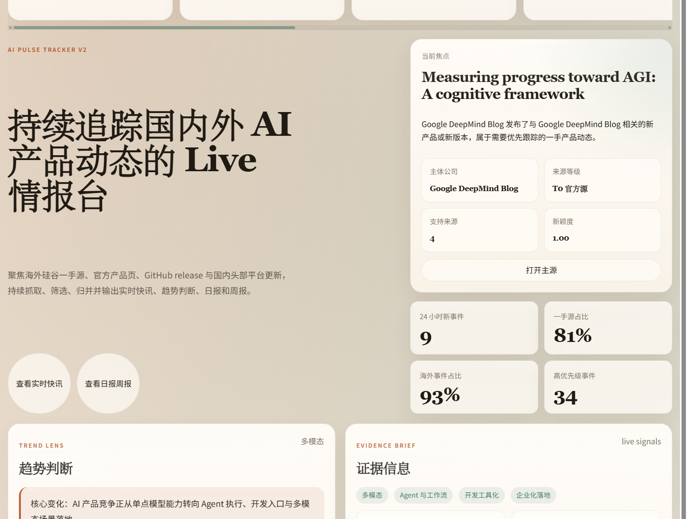
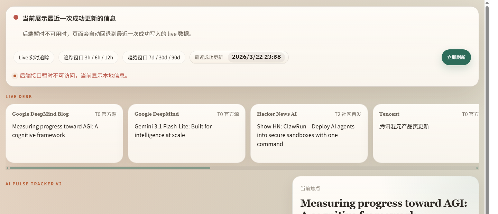
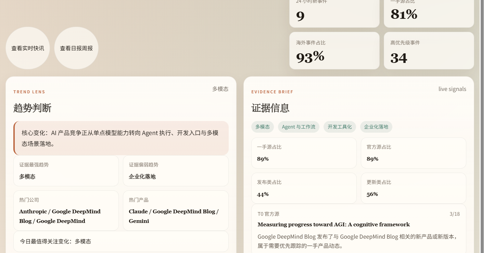
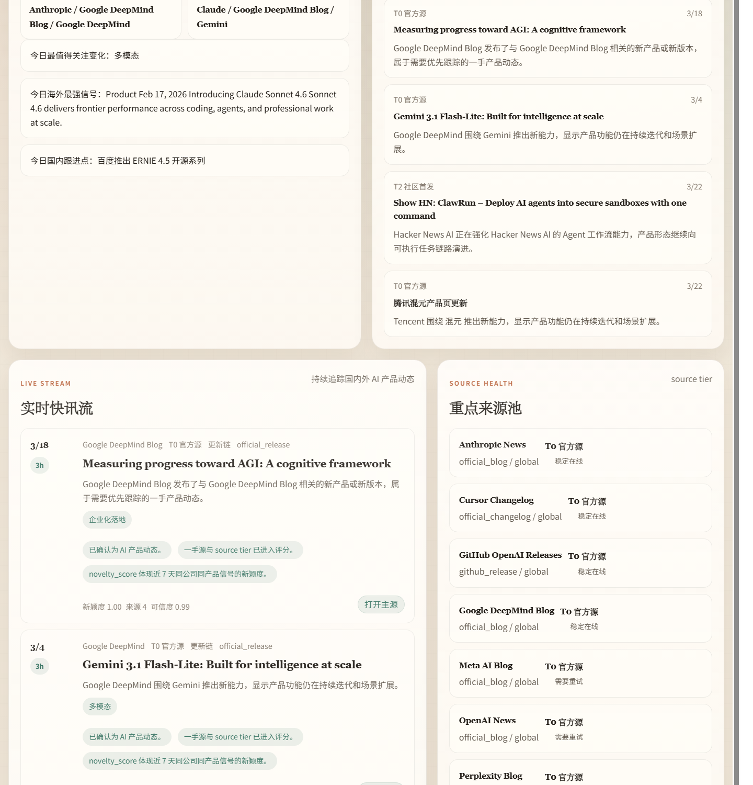
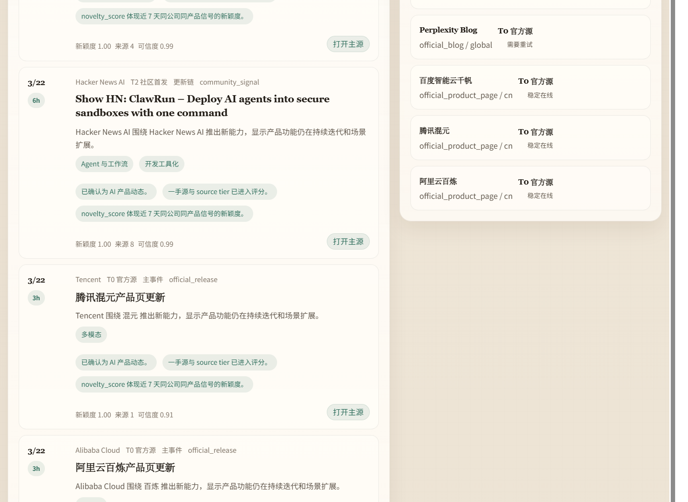

# AI 动态追踪简要分析

过去这段时间，我基本每天都会先看这个页面里的 `LIVE DESK`、顶部指标卡、趋势判断、证据快照和实时快讯流。看得多了以后，我最大的感受并不是“AI 新闻越来越多”，而是 **头部厂商正在把竞争重心，从单纯比模型能力，转向谁能更快把模型变成能被持续使用的产品能力**。这一点如果只看单条新闻，其实不一定明显；但把这些产品动作连续放到同一个页面里去看，变化会非常清楚。

## 产品层面：这一轮最明显的变化，不是模型更多了，而是产品更“贴工作流”了

页面里最先给我这个感觉的，其实是 `LIVE DESK` 和首页核心卡片里连续出现的几类产品动作。海外侧，Google DeepMind 在短时间内连续出现 **Gemini 3.1 Flash TTS**、**Gemini Robotics-ER 1.6**、**Gemma 4** 这几条更新；Anthropic 和 OpenAI 则更多围绕开发入口、模型可调用性和工作流增强释放信号。国内侧，这一轮能明显看到 **DeepSeek-V4**、**Kimi K2 Thinking**、**ERNIE 4.5**、**MiniMax M2-Her**、豆包、腾讯混元、阿里云百炼等产品页和能力更新持续出现。把这些信号放在一起看，我不会把它理解成“最近大家都在发新模型”，而更愿意把它理解成：**模型开始被快速包装成语音、机器人、推理、开发助手和 Agent 执行能力，厂商真正争夺的是用户在真实工作流里会不会持续用它。**

这件事在产品意义上很重要。模型强，更多是一种能力展示；但当它开始被做成 TTS、机器人控制、代码入口、云平台服务和网页 API 形式时，它才真正具备了“进入工作流”的能力。也就是说，这轮产品动态的重点已经不是“又有一个模型参数更大了”，而是“这个能力是否已经被包装成用户可以每天用、企业可以接进去、开发者可以调起来的产品”。这也是我认为这个页面比单纯资讯列表更有价值的原因，因为它能让我看到能力如何一步步被产品化。

## 竞争层面：海外在争入口和生态，国内在争承接速度和落地效率

从页面当前的指标看，**海外事件占比大约 72%，一手源占比大约 91%**。这两个数字本身就很有信息量。海外占比高，说明当前最密集的产品动作还是主要来自硅谷和国际头部厂商；一手源占比高，说明这些判断更多建立在官方博客、官方产品页、release 和 changelog 上，而不是媒体的二次转述。进一步看公司层面，Google DeepMind、OpenAI、Anthropic、NVIDIA、Runway、Replit、Mistral、Hugging Face 在页面里的出现频率明显更高，而且它们的动作大多围绕开发入口、多模态能力、开源模型、企业接入和生态配套展开。我的理解是，海外头部玩家现在真正想抢的是“默认工作入口”和“开发者生态位置”。

再看国内这一侧，DeepSeek、智谱、Kimi、MiniMax、豆包、百度、阿里云、腾讯这些产品信号也在连续出现，但它们的动作风格和海外不完全一样。国内这一轮更明显的是：**平台页更新更频繁、云侧承接更突出、开放平台和产品页迭代更密集**。也就是说，海外看起来更像在争夺下一代通用生产力入口，而国内更像在争取更快地把 AI 能力装进现有平台体系和商业场景里。这两条路线没有谁对谁错，但商业侧重点很不同：海外更看重入口、生态和默认位置，国内更看重接入效率、场景落地和交付速度。

## 能力迭代层面：多模态、开发工具化和 Agent，是当前最密集的三条主线

从趋势判断和证据快照来看，当前页面里的高频主题主要是 **多模态、开发工具化和 Agent**。这个结果和实际抓到的内容是能对上的。Google DeepMind 的 Gemini 3.1 Flash TTS、Gemini Robotics-ER、Gemma 4，Runway 和 NVIDIA 的相关动作，更偏多模态和场景外延；Cursor、Replit、OpenAI / Codex、Hugging Face、Mistral 这些信号，则更接近开发工具和调用入口；而 DeepSeek-V4、Kimi K2、ERNIE 4.5、MiniMax M2-Her 这类产品，则让推理、执行和 Agent 能力更像一个能部署、能接入、能被业务使用的系统，而不是演示型功能。

对我来说，这里最值得注意的，不是某个主题“热”不热，而是 **这三条线几乎在同一时间密集出现**。这意味着厂商不是在单线推进某种技术，而是在同步做三件事：补足能力边界、占领开发入口、进入工作流位置。商业上看，这会直接改变竞争单位。过去大家更容易拿单一模型性能来比较；现在真正能拉开差距的，很可能不是一次 benchmark，而是产品能不能更快形成闭环、入口能不能沉淀使用习惯、生态能不能让第三方继续围绕它扩展。

## 商业化层面：更新频率本身就是竞争信号，说明行业已经从“展示能力”走向“争取留存”

如果只看模型新闻，很多更新会显得像“发布会动作”；但放到这个页面里去看，更新频率本身就很有商业意义。过去 24 小时里有 20 条新事件，高优先级事件达到 71 条，而且其中很大一部分都来自官方源。这说明当前行业不是偶尔冒出一个大事件，而是已经进入持续迭代和高频补位阶段。对于商业分析来说，这代表的不是“热度高”，而是 **公司已经开始把 AI 当成需要持续经营的产品线，而不是一次性展示项目**。

从用户侧看，这意味着竞争目标从“第一次试用”转向“是否形成高频使用”；从企业侧看，意味着竞争重点从“模型指标领先”转向“接入是否顺畅、交付是否稳定、能否真正嵌入流程”；从厂商侧看，意味着壁垒开始从纯技术领先转向 **入口、生态、持续更新节奏和真实使用频率**。这也是为什么我认为这个页面里“日报”和“周报”很有必要，因为商业判断不能只看一个节点，而要看更新是不是在持续发生、是不是在朝同一个方向聚集。

## 国内跟进层面：国内不是没有机会，而是更像在走“平台承接 + 场景落地”的路线

页面里的国内信号其实很有代表性。DeepSeek-V4、Kimi K2 Thinking、ERNIE 4.5、MiniMax M2-Her、豆包、腾讯混元、阿里云百炼，这些产品同时出现在同一页的时候，我会明显感觉到国内厂商已经不是“只在模型层追赶”，而是在形成一条更偏平台化和交付导向的路线。比如阿里云百炼、腾讯混元、百度千帆本身就更容易和企业平台、云服务、调用入口绑定；豆包、Kimi、MiniMax 这类产品则更容易向终端体验、模型产品化和使用门槛降低方向推进。

这类路线的优点是落地速度可能更快，因为国内本来就有成熟的平台和企业服务场景；但它的压力也更大，因为如果最终只是“把模型能力挂到现有平台”而没有形成足够强的入口和心智优势，中期壁垒未必稳固。所以从国内侧看，我更关心的不是谁又发布了一个新版本，而是 **谁最先把模型能力变成平台默认能力、企业标准能力，或者用户的高频入口**。

## 页面结构为什么真的有助于形成判断

我之所以觉得这个页面有分析价值，不是因为它信息多，而是因为它把“看信息”和“做判断”拆成了几个层次。`LIVE DESK` 先把当天最值得看的产品动作拎出来；顶部指标让我快速判断当前是海外更密集，还是国内跟进更频繁；趋势判断负责把这些分散动作压缩成一句能讨论的结论；证据快照告诉我这句结论背后有哪些主题、公司和产品在支撑；实时快讯流和重点来源池又让我随时回到事实层核对来源，避免误把孤立事件当成趋势。这个结构的好处在于，我不是在看一堆平铺资讯，而是在顺着“先抓重点 -> 再形成判断 -> 再验证判断 -> 最后沉淀输出”的路径读页面。

## 风险与边界：热度不等于闭环，趋势也不代表胜负已经分出

虽然页面里现在已经能看到非常密集的产品动作，但我不会直接把这些信号等同于“商业闭环已经跑通”。例如多模态和 Agent 看起来是当前最强主线，但企业化这条线目前证据偏弱，这说明组织流程里的真正嵌入还没有完全成熟。再比如 DeepSeek、Kimi、MiniMax、豆包这类热点产品，页面可以证明它们近期动作很密集，但密集更新并不自动等于长期留存，也不等于商业模式已经稳定。Token 成本、部署门槛、安全边界、行业适配深度和用户复用频率，这些问题依然会影响中期结果。

所以我的判断不是“行业胜负已分”，而是：行业已经明确从模型竞争进入产品竞争阶段，但真正的中期壁垒仍在形成中。当前最值得继续追踪的，是多模态、Agent 和开发工具化；再往后看，真正能拉开差距的，大概率不只是模型性能，而是 **入口、生态、交付效率和真实使用频率**。

## 我的判断

如果只用一句话概括，我会这样说：**这一轮 AI 产品动态里，最值得关注的不是谁又发了一个模型，而是谁正在更快地把模型变成用户愿意持续使用的产品入口。** 从页面当前追踪到的信号看，海外头部厂商已经明显把重心放在入口、生态和开发工具上；国内玩家则在追赶模型和 Agent 能力的同时，更强调平台承接和商业落地。短期内，多模态、Agent 和开发工具化仍然是最值得持续盯住的主线；中期真正能形成壁垒的，更可能是入口、生态、交付效率和留存，而不是单次模型发布本身。
